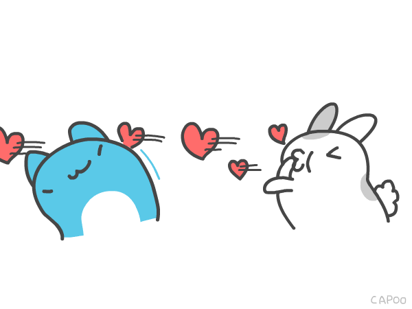

<html lang="en">
<head>
    <link rel="stylesheet" href="style.css">
    <link href="https://fonts.googleapis.com/css2?family=Indie+flower&display=swap" rel="stylesheet">

</head>
<body>
    

        <h1 class="header_text">Hi bubbyy, do u wanna go out with me?</h1>
        

            
        

        

            <button class="btn" id="yesButton" onclick="nextpage()">YES</button>
            <button class="btn" id="noButton" onmouseover="movebutton()">NO</button>
        

    

    
</body>
</html>
